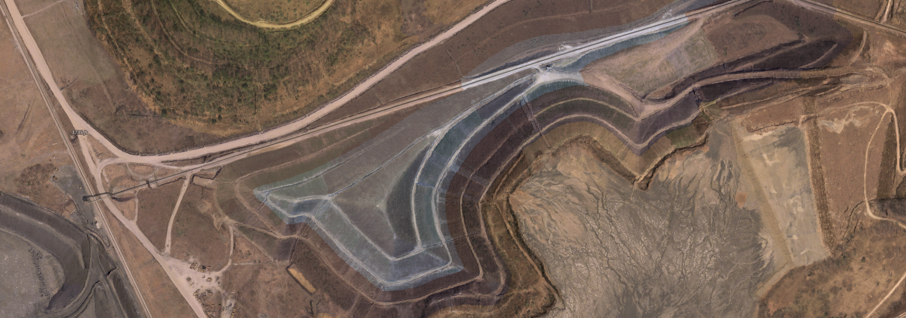

# kyfromabove-gisconference2025-workshop
This workshop will explore ways to have fun with KyFromAbove data.

Information, Resources, activities and instructions are on the [workshop](https://ianhorn.github.io/kyfromabove-gisconference2025-workshop/) site. 

