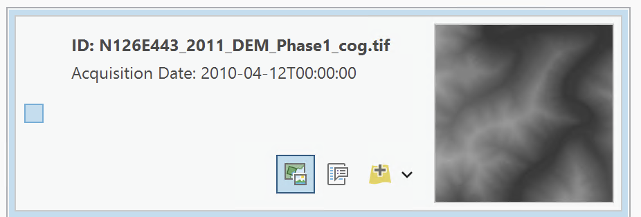

Minimum Requirements: ArcGIS Pro 3.2

## Use the STAC API in an ArcGIS Pro project.

1. Open ArcGIS
2. Click map
3. Give you New Project a name

### Cloud Store

A Cloud Store connection file is a method to crawl a cloud bucket/container like a regular folder.  In some instances, these are required when connecting to STAC APIs.  You can download a .ACS file from the [AWS Explorer](https://kyfromabove.s3.us-west-2.amazonaws.com/index.html).  To create your own, use the instructions below.

In the Ribbon at the top, click on Insert, Connection, New Cloud Store Connection.

<p align="center">
  
</p>

In the dialog create a name for the connection file, select AMAZON as the Service Provider, kyfromabove for the Bucket (Container) Name, and US WEST (Oregon) for the Region (Environment).  

For Provider options, add AWS_NO_SIGN_REQUEST with a value of yes.

<p align="center">
  
</p>

### STAC Connection File

To get starting exploring the STAC API, the first item you need to make sure you have is a `STAC Connection`

<table>
 <tr>
  <td>
   <ol>
    <li>In ribbon at the top, click <strong>Insert</strong></li>
    <li>Click on <strong>Connections</strong></li>
    <li>With your mouse, hover over the <br><strong>STAC Connection</strong></li>
    <li>Select, create new collection.</li>
   </ol>
  </td>
   <td>
    
    </img>
   </td>
  </tr>
</table>

This gives us the *Create STAC Connection* dialog box.

<p align="center">
 </img>
</p>

Connection Name: *KyFromAbove-STAC*   
Connection:

```bash
https://spved5ihrl.execute-api.us-west-2.amazonaws.com/
```

Optionally, add the Cloud Storage Connection we created earlier.

You should now have a Catalog Pane that looks like this with you cloud storage connection and stac connections.

<p align="center">
  
</p>

Save your project.  Also, on your own machines, you may right click on the either of the connections and choose to save to favorites and add to new projects.  
___
### Explore the STAC

In the map, zoom to and area of interest.  For this example, I have zoomed to the area in western Kentucky around Grand Rivers in Livingston, County.

<p align="center">
  
</p>

#### Open Explore STAC Pane
In the catalog pane, right click on the STAC Connection file we created in the above step, and click on the *Explore STAC...*.  This will open a new pane.  Feel free to move it around according to your preference.

<p align="center">
  
</p>

For this example, I will check the box for the *orthos-phase3*.  Then in the Extent option, I will choose *Current Display Extent*.  This will modify the min and max xy values.  Click on *View Results* at the bottom.

Take a moment to explore the options on the *Results* tab for the Explore STAC pane.  

1. The `ID:N160E083_2024_Season1_3IN...` is known as the STAC Item ID.
 - Below that, we see an acquisition date.
2. In the bottom of an Item's tab, click on the white icon in the middle of the three icons.  This is the Properties Box.  Explore this for a second.  
3. Click on the green icon to the left.  This will drop a footprint onto your map. Very useful for knowing where the Item will draw on the map.
4. Finally, use the yellow add layer button to add to file to your map.  

<p align="center">
  
</p>

You are now *STREAMING* a cloud-optimized geotiff straight from the cloud to your desktop application.  

#### Add Multiple Footprints
You can now explore the STAC even further.  You may need to zoom in closer or farther away, adjust the extent and refresh the results.

I'm going to add four footprint (like a square) over the Kentucky DAM/Lake City areas.

<p align="center">
  
</p>

#### Add a Mosaic

Now check the boxes for the items you have as footprints in the map.  The footprint icons subtely highlight.  At the top of the pane, click on the add raster (blue/white) icon to choose from the menu.  Select the *Add as Mosaic Layer to Current Map*.

<p align="center">
  
</p>

It may take a few moments becauses Pro is pulling information from the cloud.  Once that is complete, rendering will be much faster.  For the record, I'm using tiles N164E082, N164E083, N165E082, and N165E083

I now have four items seamlessly mosaicked in my map view.  Explore the mosaic by zooming in and out.  

<p align="center">
  
</p>

Go ahead and right click the STAC mosaic layer and rename it by opening the properties dialog box.  (Don't forget to save the project occasionally).  


___
Let the fun begin.

With the mosaic layer still selected in the Contents Panel, toggle open Imagery in the top ribbon.  Search for *Raster Functions* and open.  Click on green leaf icon in the Analysis for *NDVI Colorized*.  

<p align="center">
  
</p>  

 - Make sure you select the mosaic layer we just created for Raster.  
 - Change *Infrared Band ID* to 4.  
 - click *Create New Layer*

 With both mosaic layers turn on, select the newly created colorized NDVI raster in the contents pane.   

 - Click on *Raster Layer* tab in the top ribbon.  
 - Play with *Transparency* percentages.  
 - Play with *Layer Blend* option.  

<p align="center">
  
  <figcaption>Zoomed-in image of quarry with the NDVI raster at 10% transparency and *saturation* used for blend mode.</figcaption>
</p>  

___
### Analysis - Change Detection

#### Set up new AOI

You may now toggle off the NDVI raster.  For this section, we are going to perform a change detection analysis using the two mosaicked layers, but from different time periods. Lets start by changing our area of interest by zoom out of western Kentucky and zooming over to eastern most part of the state in Pike County.  South of Woodman, and just south of the Lower Elk Creek near North Hollow, is a coal mine. X marks the spot.

<p align="center">
  
  
  <figcaption>Coal mine south of Woodman, Kentucky.</figcaption>
</p>

<!-- <p align="center">
  
  <figcaption>Coal mine south of Woodman, Kentucky.</figcaption>
</p>   -->


Back in the *Explore STAC* pane, on the *Parameters* tab, uncheck any collections.

 - Check the *dem-phase1* collection.
 - Alter the extent to include the map's current view.
 - Click *View Results*
 - Mosaic 4 tiles   
    - N126E433_2011...
    - N126E444_2011...
    - N127E443_2011...
    - N127E444_2011...
 - Add as a mosaic layer to your map
 - Rename new mosaic to DEM-Phase1

Repeat steps for phase3 dem.  Add the same 4 tiles to as a mosaic layer and rename DEM-Phase3
Feel free to play around with the swipe tool in the Imagery tab, try out any raster functions, etc.
<p align="center">
  
  <figcaption>AOI in Pike County, Kentucky with footprints overlain.</figcaption>
</p>

Feel free to turn off the footprints or remove from the map.  Remember to save the project occasionally.

#### Perform Change Detection

Click on the Imagery tab at the top, select the *Change Detection* icon and this will open the *Change Detection Wizard* pane.  