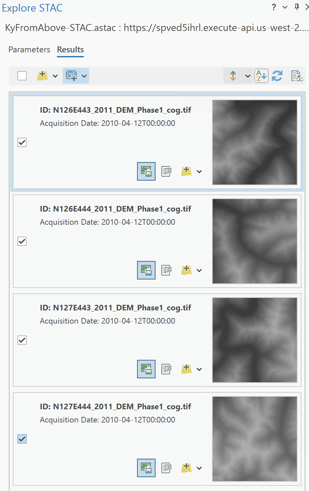
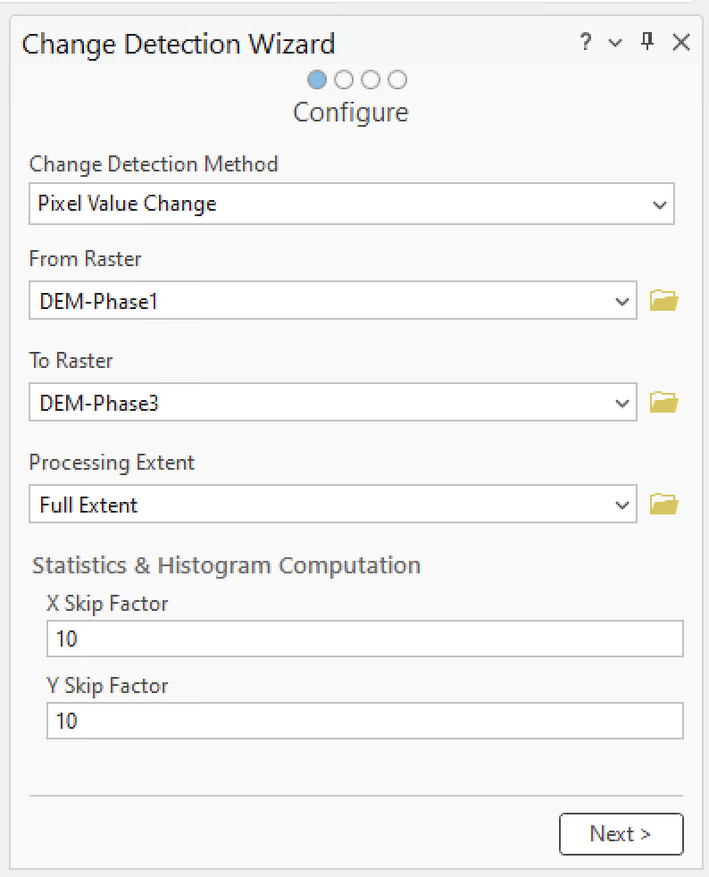
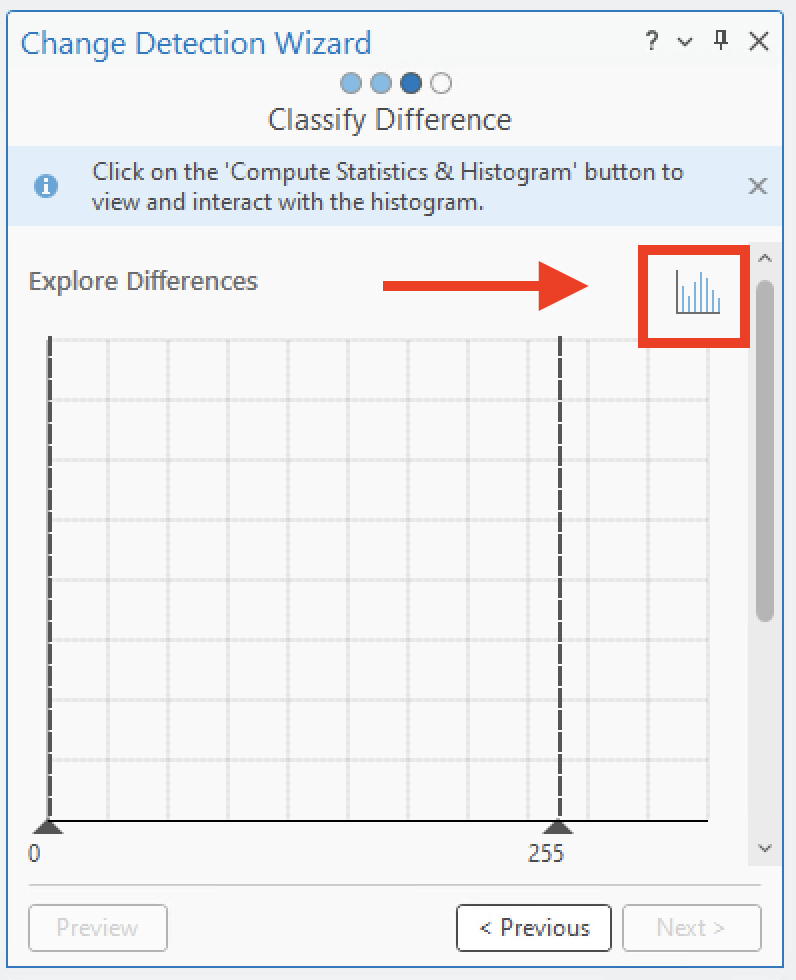

Minimum Requirements: ArcGIS Pro 3.2

## Use the STAC API in an ArcGIS Pro project.

1. Open ArcGIS
2. Click map
3. Give you New Project a name

### Cloud Store

A Cloud Store connection file is a method to crawl a cloud bucket/container like a regular folder.  In some instances, these are required when connecting to STAC APIs.  You can download a .ACS file from the [AWS Explorer](https://kyfromabove.s3.us-west-2.amazonaws.com/index.html).  To create your own, use the instructions below.

In the Ribbon at the top, click on Insert, Connection, New Cloud Store Connection.

  
  <figcaption><strong>Figure:<strong> Insert a <em>New Cloud Storage Connection</em></figcaption>

In the dialog create a name for the connection file, select AMAZON as the Service Provider, kyfromabove for the Bucket (Container) Name, and US WEST (Oregon) for the Region (Environment).  

For Provider options, add AWS_NO_SIGN_REQUEST with a value of yes.

  

### STAC Connection File

To get starting exploring the STAC API, the first item you need to make sure you have is a `STAC Connection`

<table>
 <tr>
  <td>
   <ol>
    <li>In ribbon at the top, click <strong>Insert</strong></li>
    <li>Click on <strong>Connections</strong></li>
    <li>With your mouse, hover over the  <strong>STAC Connection</strong></li>
    <li>Select, create new collection.</li>
   </ol>
  </td>
   <td>
    
    </img>
   </td>
  </tr>
</table>

This gives us the *Create STAC Connection* dialog box.

 
<figcaption><strong>Figure:<strong> Create a new <em>New STAC Connection</em>.</figcaption>

Connection Name: *KyFromAbove-STAC*   
Connection: `https://spved5ihrl.execute-api.us-west-2.amazonaws.com`

Optionally, add the Cloud Storage Connection we created earlier.

You should now have a Catalog Pane that looks like this with your cloud storage and stac connections.

  

Save your project.  Also, on your own machines, you may right click on the either of the connections and choose to save to favorites and add to new projects.  
___
### Explore the STAC

In the map, zoom to and area of interest.  For this example, I have zoomed to the area in western Kentucky south of Woodman in Pike County, Kentucky.

  
  <figcaption><strong>Figure:</strong> Area of Interest, coal mine south of Woodman.  *X* marks the spot.</figcaption>

#### Open Explore STAC Pane
In the catalog pane, right click on the STAC Connection file we created in the above step, and click on the *Explore STAC...*.  This will open a new pane.  Feel free to move it around according to your preference.

  
  <figcaption><strong>Figure:</strong> Explore STAC Panel.</figcaption>

For this example, I will check the box for the dem-phase1.  Then in the Extent option, I will choose *Current Display Extent*.  This will modify the min and max xy values.  Click on *View Results* at the bottom.

Take a moment to explore the options on the *Results* tab for the Explore STAC pane.  

1. The `ID:N126E433_2011_DEM_Phase1_cog.tif` is known as the STAC Item ID.
2. In the bottom of an Item's tab, click on the white icon in the middle of the three icons.  This is the Properties Box.  Take a minute to explore the Item properties. 

  
  <figcaption><strong>Figure:</strong> STAC Item Properties.</figcaption>

3. Click on the green icon to the left.  This will drop a footprint onto your map. Very useful for knowing where the Item will draw on the map.  
4. Finally, use the yellow add layer button to add to file to your map.  

  
  <figcaption><strong>Figure:</strong> Item card display in the results tab.

You are now *STREAMING* a cloud-optimized geotiff straight from the cloud to your desktop application.  

#### Add Multiple Footprints
You can now explore the STAC even further.  You may need to zoom in closer or farther away, adjust the extent and refresh the results.

I'm going to add four footprint (like a square) over the mining area.

  
  <figcaption><strong>Figure:</strong> Footprints added to a map in ArcGIS Pro.</figcaption>

#### Add a Mosaic

Now check the boxes for the items you have as footprints in the map.  The footprint icons subtely highlight.  At the top of the pane, click on the add raster (blue/white) icon to choose from the menu.  Select the *Add as Mosaic Layer to Current Map*.

  
  <figcaption><strong>Figure: </strong>Four items selected and ready to be mosaicked and added to the map.</figcaption>

It may take a few moments becauses Pro is pulling information from the cloud.  Once that is complete, rendering will be much faster.  For the record, I'm using tiles N126E443, N126E444, N127E443, amd N127E444.

I now have four items seamlessly mosaicked in my map view.  Explore the mosaic by zooming in and out.  

  
  <figcaption><strong>Figure: </strong> Four STAC items seamless mosaiced streaming</figcaption>

Go ahead and right click the STAC mosaic layer and rename it by opening the properties dialog box.  Call it *DEM-Phase1*.  (Don't forget to save the project occasionally).  

___
Let the fun begin.

With the mosaic layer still selected in the Contents Panel, toggle open Imagery in the top ribbon.  Search for *Raster Functions* and open.  Type in the word *Hillshade* and click that icon.  

  
  <figcaption><strong>Figure: </strong>Raster Function Panel.</figcaption>

  

 - Change *Hillshade Type* to *Multidirectionl*.  
 - Change *Scaling* to *Adjusted*. 
 - click *Create New Layer*

 With both mosaic layers turn on, select the newly created colorized Multidirection Hillshade raster in the contents pane.   

 - Click on *Raster Layer* tab in the top ribbon.  
 - Play with *Transparency* percentages.  
 - Play with *Layer Blend* option.  

  
  <figcaption><strong>Figure: </strong>Zoomed-in image of mine raster at 0% transparency and *Pin Light* used for blend mode.</figcaption>
  
 - Switch blend back to normal.

 Repeat the steps for the same Phase 3 DEM tiles.  Once added to the map as a mosaic layer, rename raster to *DEM-Phase3*. Toggle off any raster layers we added.  Repeat steps to create another multidirectional hillshade raster.

___
### Analysis 

#### Change Detection

For this section, we are going to perform a change detection analysis using the two mosaicked layers from different time periods. Like before, will used the mine South of Woodman, and just south of the Lower Elk Creek near North Hollow. ***X*** marks the spot.

  
  
  <figcaption><strong>Figure: </strong>Coal mine south of Woodman, Kentucky.</figcaption>

Click on the Imagery tab at the top, select the *Change Detection* icon and this will open the *Change Detection Wizard* pane.

#### Configure the wizard

  - *Change Detection Method* - Pixel Value Change
  - *From Raster* - DEM-Phase1
  - *To Raster* - DEM-Phase3
  - *Statistics and Histogram Computation* - use default values
  

    
    <figcaption><strong>Figure: </strong>Change Detection Wizard Panel.</figcaption>
  

 - Click *Next >*  
 - Leave the *Band Difference* with default values. Click *Next >*  

On the next Change Detection Wizard page, the tool tells us we need to calculate statistics.  

 - Click on the bar chart icon in the top right hand corner to do so.
 

  
  <figcaption><strong>Figure: </strong>Classify Difference page for the change detection wizard.  Click on the statistics graph icon in top right corner.</figcaption>

    

- Uncheck *Classify the difference in values. 
- Click *Next >* to move to *Output Generation*.   
- Leave values as default and click *Preview* at the bottom.  
 
You should see something like this. 

  
  <figcaption><strong>Figure: </strong>Image Preview using the Change Detection Wizard.  Green indicates a negative change while red indicates a positive change.</figcaption>

 

 - Back in the wizard panel, rename output to *ChangeDetection.tif*.
 - Click *Run*

 The result will be a raster with a linear scale of our values with darker showing decreases and white showing increases.  Take a moment to play around with *Raster Layer -> Layer Blend* values.

#### Output

You should see something like this. 

  
  <figcaption><strong>Figure: </strong>Tiff output of Change Detection Wizard with 0% transparency and layer blend set to <em>Vivid Light</em>.</figcaption>

 

This concludes the activity of playing around with a STAC API in ArcGIS Pro v 3.5.X.  Feel free to continue exploring until we move to the next activity.