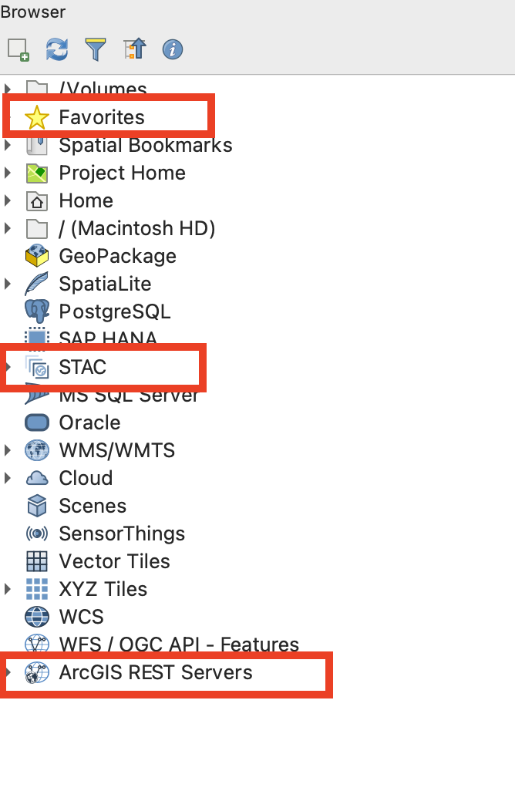
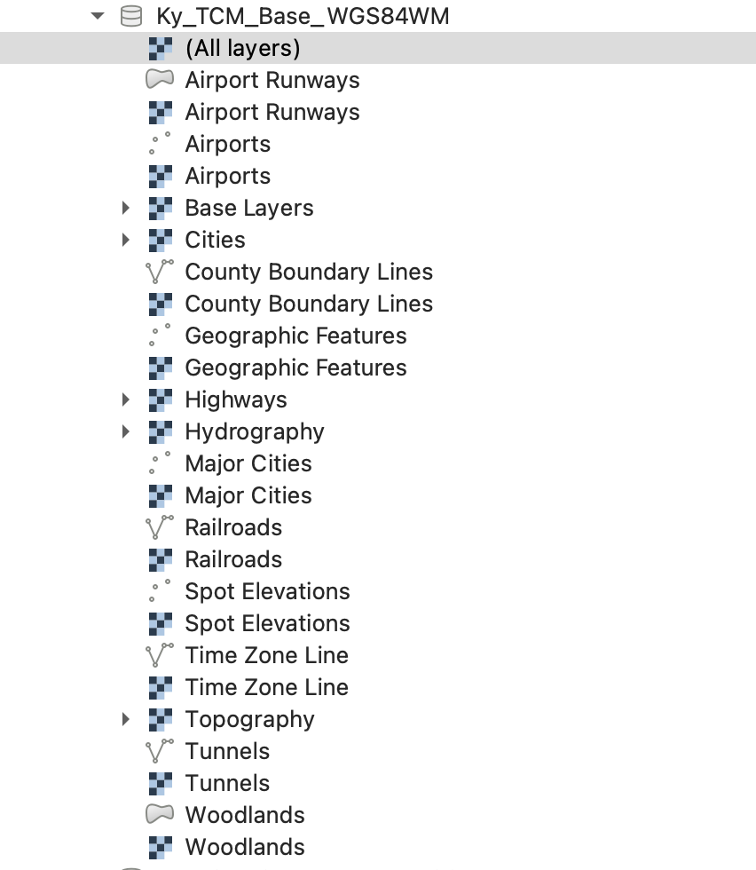
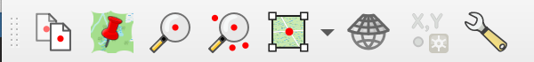
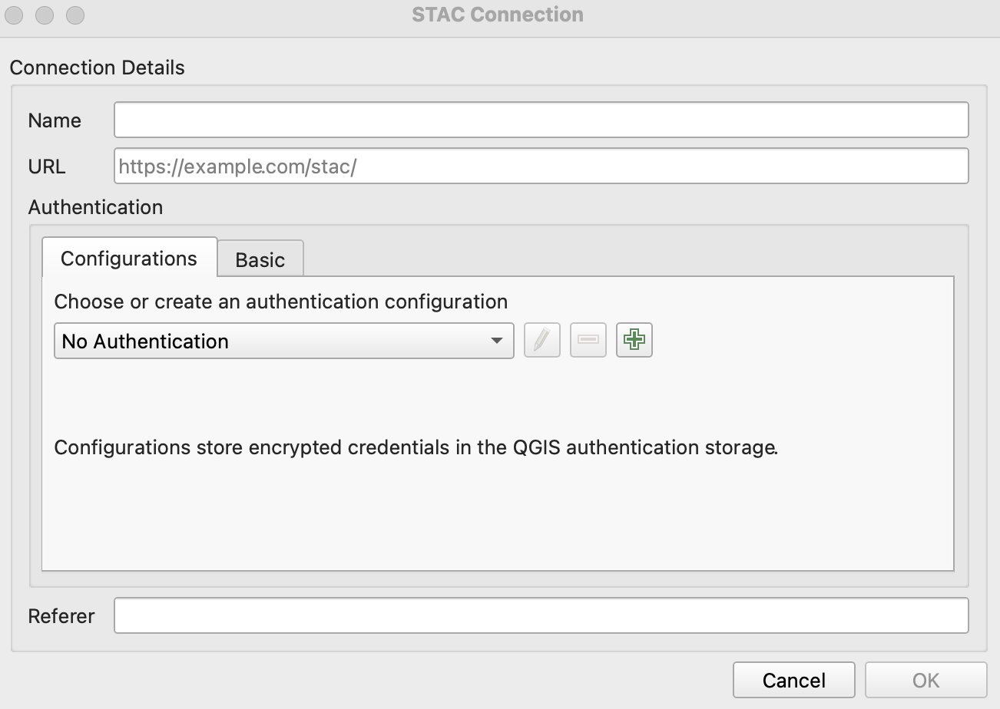
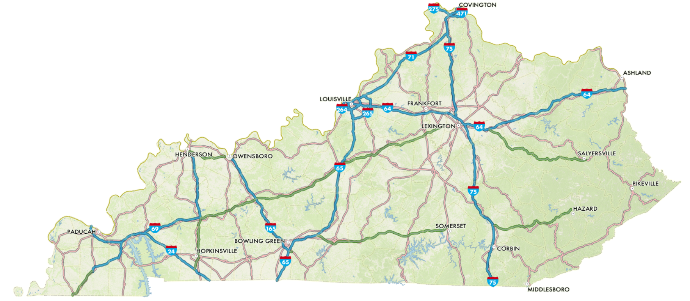
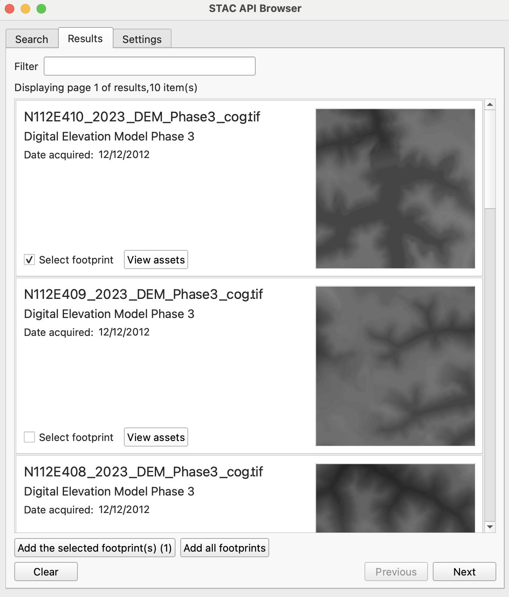
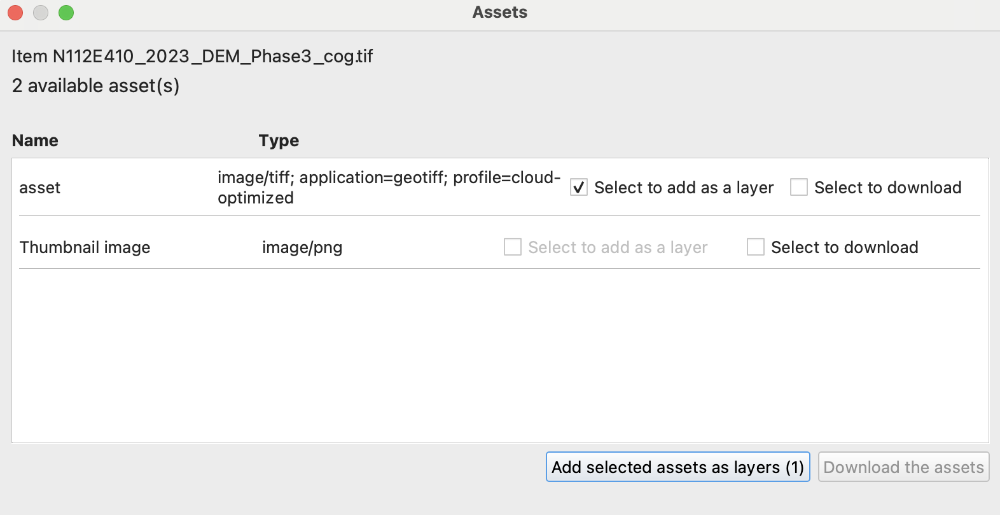
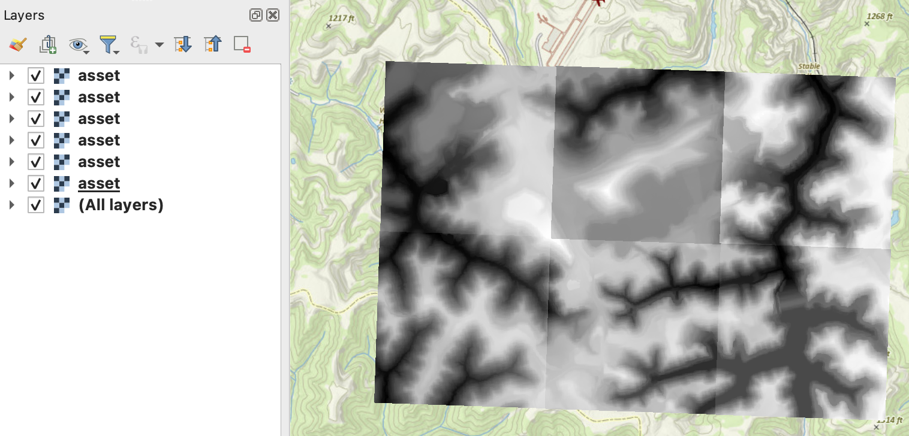
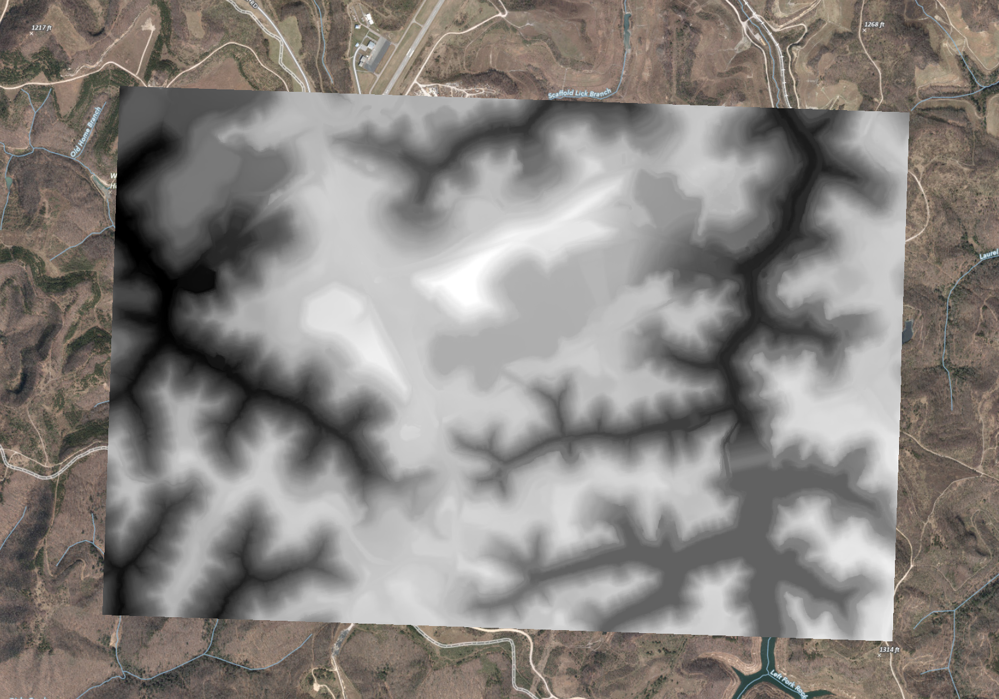

# Using STAC API with QGIS

Minimum Requirements: QGIS 3.0.0, recommended >= QGIS 3.38.X

*Note: Due to workshop locale restraints, it is not possible to perform this exercise.  Below is just a primer I am providing for anyone who wants to use this open Github Page or for you to continue working on your own time/machines.*  

I like to make sure my Browser in QGIS has a view items set up.  

 
 <figcaption><strong>Figure:</strong> QGIS Browser Panel - I like to make sure my QGIS has REST Services, STAC connections, and local directories already set to go.
 </figcaption>

## Browser Panel

- Add relevant directories (e.g., Downloads, Documents, etc)
- Add STAC Connections
    - Name *kyfromabove*
    - API URL  `https://spved5ihrl.execute-api.us-west-2.amazonaws.com/`
- REST Servers
    - *kyraster* `https://kyraster.ky.gov/arcgis/rest/services/`
    - *kygisserver* `https://kygisserver.ky.gov/arcgis/rest/services/WGS84WM_Services/`

Toggle open *kygisserver* under ArcGIS REST Servers, scroll towards the bottom and look for *Ky_TCM_Base_WGS84WM*.  

Toggle open, right click on layers, add to map.  Optionally, in the Layers panel, right click and save as a layerfile locally to use in future projects.

    
    <figcaption><strong>Figure:</strong> REST Services connections setup in the Browser panel in QGIS.
    </figcaption>

## Plugins and Connections

1. *Lat Lon Tools* - quickly capture extent coordinates

2. *STAC API Browser*   

Set up STAC Connections

1. In Browser panel, right click STAC
2. Add Connection
3. Connection Name - *kyfromabove*  
4. URL - `https://spved5ihrl.execute-api.us-west-2.amazonaws.com/`

    
    <figcaption><strong>Figure:</strong> STAC Connection dialog box.
    </figcaption>

At this point you have all the relavent connections, services, and layers.

    
    <figcaption><strong>Figure:</strong> Minimum connections and layers for QGIS project.
    </figcaption>

## Add STAC Data

Zoom to a location of interest on the map.  Eventually, you may need to zoom in or out to get an appropriate query result from the API Browser.

I have randomly zoomed to an airport in Martin County (easter Kentucky).  FYI, using the Lat Lon Tools I quickly grabbed my extent.  *-83.44882668,37.26136889,-82.05662517,38.27153324* 

STAC Browser API Plugin 

- Make sure the *kyfromabove* connection is selected.  
- Click Fetch Collections.  
- Click on the *Digital Elevation Model Phase 3* so that it is selected
- For extent, click *Map Canvas Extent*
- Scroll down, click search

Depending on your internet connection, the seach query should be quick (seconds).  

    
    <figcaption><strong>Figure:</strong> Search results for an area of interest using the map view extent with the STAC Browser plugin.  
    </figcaption>

I like to add all assets footprints, provided the results are 10 or less.  This way, I can see which IDs in the search results match up to the footprints in the map.  

In the STAC Browser window:

 - click on an asset you want to use
 - Check *add layer to the map*.
 - Click *Add selected asset as a layer*

 

 Repeat this for your area of interest.  I have using 6 assets, making a 3x2 grid.  N111E408-410 and N112E408-410.  Any more than this,  I would recommend using the python terminal in qqis to search the API to add layers.  

 

 Now what?  We don't want to analyze the tiles individually, but as a group.  Solution.  Build a virtual raster.

 - In the processing toolbox, type *Build Virtual Raster*
 - Double Click the tool under *GDAL*
 - For input layers, click on 3 dots
 - Select the six layers we added
 - Click the back arrow at top left
 - If no other changes needed, click run

 

    
    <figcaption><strong>Figure:</strong> Virtual Raster built from six STAC Item assets added to the map.  
    </figcaption>

The benefit of mosaicking like this is you avoid the need to download individual tiles. You create a virtual raster from streaming COGs (and export virtual raster locally if you want).

Play around with different processing tools.  For some, like the Whitebox Geotools Plugin, you will need to export your virtual raster to a local directory.  

