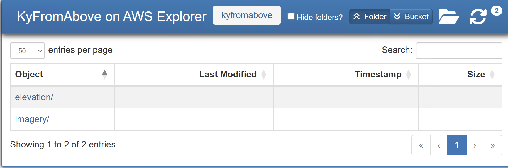
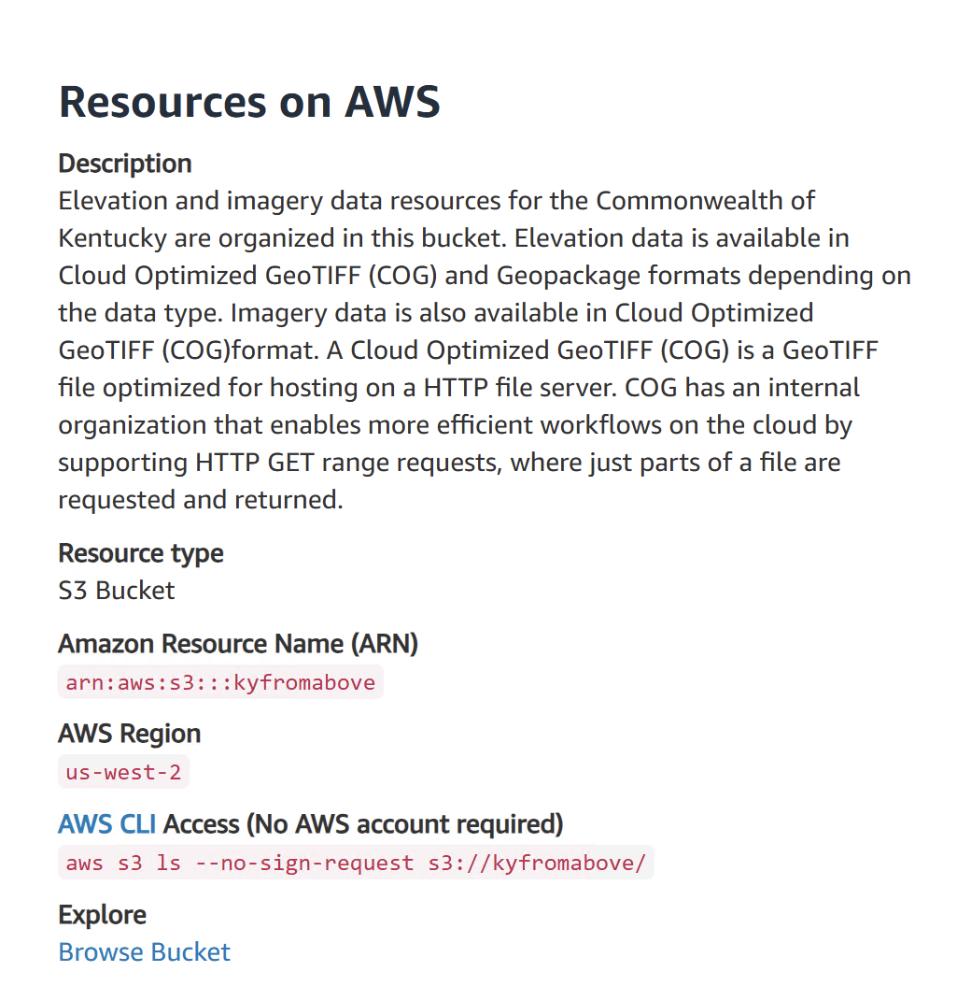

# Resources

## STAC API

```html
https://spved5ihrl.execute-api.us-west-2.amazonaws.com/
```

## Stac-Browser

```html
https://kygeonet.ky.gov/stac
```

## KyGISServer

```html
https://kygisserver.ky.gov/arcgis/rest/services/WGS84WM_Services
```

[kygisserver](https://kygisserver.ky.gov/arcgis/rest/services/WGS84WM_Services) is DGI's public-facing vector-based GIS server.  The above URL is the REST Endpoint Service.  These services can be connected to many GIS softwares such as QGIS and ArcGIS Pro.  The services may also be leveraged according the the [API Documentation](https://kygisserver.ky.gov/arcgis/sdk/rest/02ss/02ss00000029000000.htm).

## Open Data Portal

```html
https://opengisdata.ky.gov/
```

The KyGovMaps [Open Data Portal](https://opengisdata.ky.gov/) is another great resource for vector data sources.  This is also the place you want to visit for **Metadata**.  *It will be the only source for metadata once [KyGeoPortal](https://kygeoportal.ky.gov) retires in October 2025.*

## KyRaster

```html
https://kyraster.ky.gov/arcgis/imagery
https://kyraster.ky.gov/arcgis/elevation
```

[kyraster](https://kyraster.ky.gov/arcgis/rest/services) is GIS Server that hosts the Commonwealth imagery and elevation data.  The above REST Service Endpointd URL functions the same way as *kygisserver*.  Documention on how to use is in the KyRaster [API Documentation](https://kyraster.ky.gov/arcgis/sdk/rest/index.html#//02ss00000029000000)

From the service endpoint, data services reside in the *Imagery* and *Elevation* folders.  

## KyFromAbove on AWS Explorer

```html
https://kyfromabove.s3.us-west-2.amazonaws.com/index.html
```

This is a javascript-based [Explorer](https://kyfromabove.s3.us-west-2.amazonaws.com/index.html)  serves the kyfromabove aws bucket as an explorer-like environment.  This is a great resource to download files if you already know the name of the file.  Also, it also contains links to tile grids in Geopackage formats that can be view in desktop software, python, online viewers, and so on.

<p align="center">
 
 <figcaption><strong>Figure:</strong> A explore like way to search for KyFromAbove files on AWS.</figcaption>
</p>

## Open Data Registry on AWS

```cmd
https://registry.opendata.aws/kyfromabove/
```

KyFromAbove's landing page in the [AWS Open Data Registry](https://registry.opendata.aws/kyfromabove). This page contains descriptions for KyFromAbove products, code snippets to get you started search the bucket with [AWSCLI](https://docs.aws.amazon.com/cli/latest/userguide/cli-chap-welcome.html) Command Line Interface, links to tools, publications, endpoints, etc.  

<p align="center">
  
  <figcaption><strong>Figure</strong> Resouce description on the KyFromAbove landing page on the [AWS Open Data Registry](https://registry.opendata.aws/kyfromabove/).</figcaption>
</p>