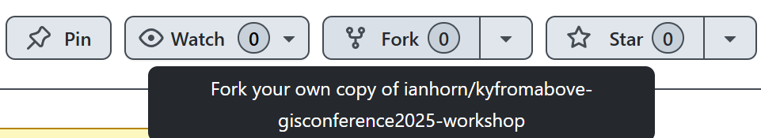

# Getting Started

For this exercise, you will need to choose a platform for which you can run a python notebook.  Examples include but are not limited to:

 - [Google Colab](https://colab.research.google.com/) - Easy Setup
 - [SageMaker Studio Lab](https://studiolab.sagemaker.aws/) - Must already have an account - takes time to get approvedy
 - Local Jupyter - recommended only for experienced python users
    - using a conda/mamba environment
    - using a virtual environment with pip (e.g., python -m venv myenv + pip install jupyter)

___
## Fork the repo - Optional

This part is optional.  You must either have a Github account or create one now.  Go to the [Github](https://github.com) and sign in or [Sign Up](https://github.com/signup)

From your Github Dashboard, use the search bar at the top.
___

___
Copy and paste the following:

```
repo:ianhorn/kyfromabove-gisconference2025-workshop
```

Once you are on this page, click on *Fork* in the top right corner to for this repo.
___

___
You can use my repository name or you can edit to your own.  

___
## Setting up Google Colab

> Colab is a hosted Jupyter Notebook service that requires no setup to use and provides free access to computing resources, including GPUs and TPUs. Colab is especially well suited to machine learning, data science, and education.

All you need is Google account to use Google Colab is a Google Account.

1. Click the Google Colab [Link] (https://colab.research.google.com/)
2. Sign in 
3. At the top, click *File* --> *Open Notebook*
4. Click on *Github* on the left.
5. Enter `https://github.com/ianhorn/kyfromabove-gisconference2025-workshop` as the github URL.

For step 5, you may need to click outside the search URL box for the Repository to change.
___

___

## Local Setup

1. [Fork](#fork-the-repo---optional) the repo
2. Setup python environoment

Conda
```bash
conda init
conda env create -f environment.yml
conda activate workshop-env
```

Virtual Environment
 
 - Windows
```bash
python -m venv venv
venv\Scripts\activate.bat
python -m pip install -r requiements.txt
```
 - mac/linux
```bash
python -m venv venv
source venv/bin/activate
python -m pip install -r requiements.txt
```
