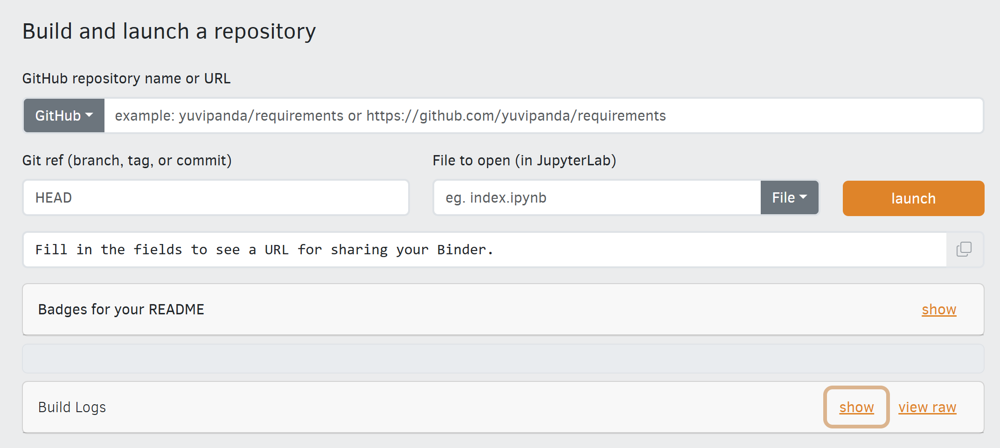

# Using Binder

Binder allows us to use an already created environment notebook from a (Github) repository.

On the MyBinder [landing page](https://mybinder.org), you will see an interactive block for which to launch the repo with its python environment set up for us.

1. Grab you forked repo URL.
Or use mine: `https://github.com/ianhorn/kyfromabove-gisconference2025-workshop`

Leave the **Git ref** as _head_ and **Files to open** blank.  Then click `launch`

You can **show** the _Build Logs_ to monitor process.