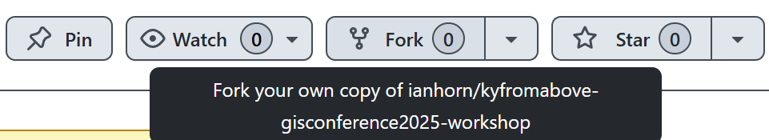

# Fork the repo

This part is optional.  You must either have a Github account or create one now.  Go to the [Github](https://github.com) and sign in or [Sign Up](https://github.com/signup)

From your Github Dashboard, use the search bar at the top.
___

___
Copy and paste the following:

```
repo:ianhorn/kyfromabove-gisconference2025-workshop
```

Once you are on this page, click on *Fork* in the top right corner to for this repo.
___

___
You can use my repository name or you can edit to your own.  
