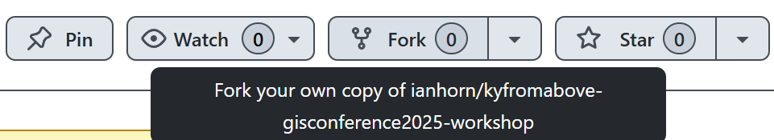

# Getting Started

For this exercise, you will need to choose a platform for which you can run a python notebook.  Examples include but are not limited to:

 - mybinder
 - [Google Colab](https://colab.research.google.com/) - Easy Setup
 - [SageMaker Studio Lab](https://studiolab.sagemaker.aws/) - Must already have an account - takes time to get approved
 - Local Jupyter - recommended only for experienced python users
    - using a conda/mamba environment
    - using a virtual environment with pip (e.g., python -m venv myenv + pip install jupyter)

Some items your may need:

    Google Login
    Kaggle Login
    Github Login

# Fork the repo - Optional

This part is optional.  You must either have a Github account or create one now.  Go to the [Github](https://github.com) and sign in or [Sign Up](https://github.com/signup)

From your Github Dashboard, use the search bar at the top.
___

___
Copy and paste the following:

```
repo:ianhorn/kyfromabove-gisconference2025-workshop
```

Once you are on this page, click on *Fork* in the top right corner to for this repo.
___

___
You can use my repository name or you can edit to your own.  
