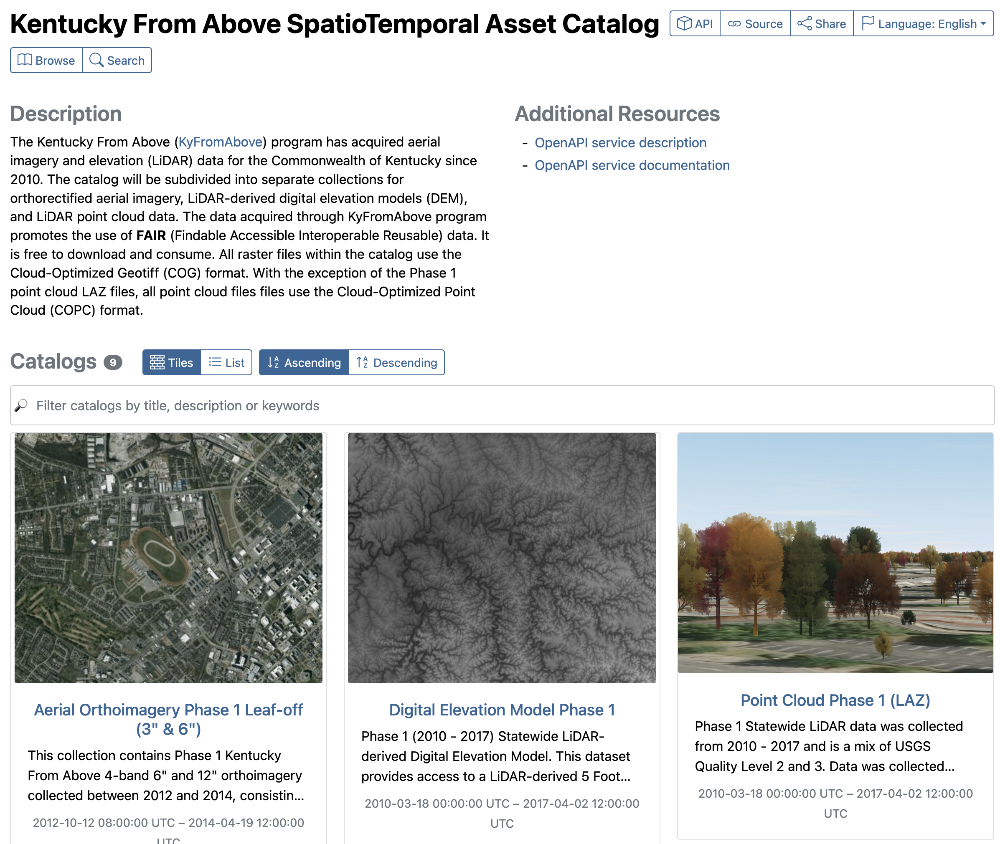

# Stac-Browser

## Landing Page

Finally, what we really want to see.

It turns an ugly JSON file into a user friendly experience.  Please open a browser and go to the KyFromAbove Stac-Browser **Landing Page**:

```cmd
https://kygeonet.ky.gov/stac
```



### Button Functions

Let's take a look at the top right hand corner by clicking on each button to see what's they show.

| Button   | Display                                |
|----------|----------------------------------------|
| API      | Conformance Classes – API compliances  |
| Source   | ID, Version, Validity, Metadata File   |
| Share    | Share the URL or to social media       |
| Language | Switch Languages                       |

On the left we have the browse and search buttons.

| Button   | Function                                                 |
| -------- | ---------------------------------------------------------|
| Browse   | Opens a side tab to toggle between collections           |
| Search   | Perform a search at the collection or item level (2 tabs)|

### Additional Resources

| Term                          | Description                           |
| ----------------------------- | ------------------------------------- |
| OpenAPI service description   | JSON file describing the API endpoint |
| OpenAPI service documentation | API exploration, playground, tool     |

## Explore

