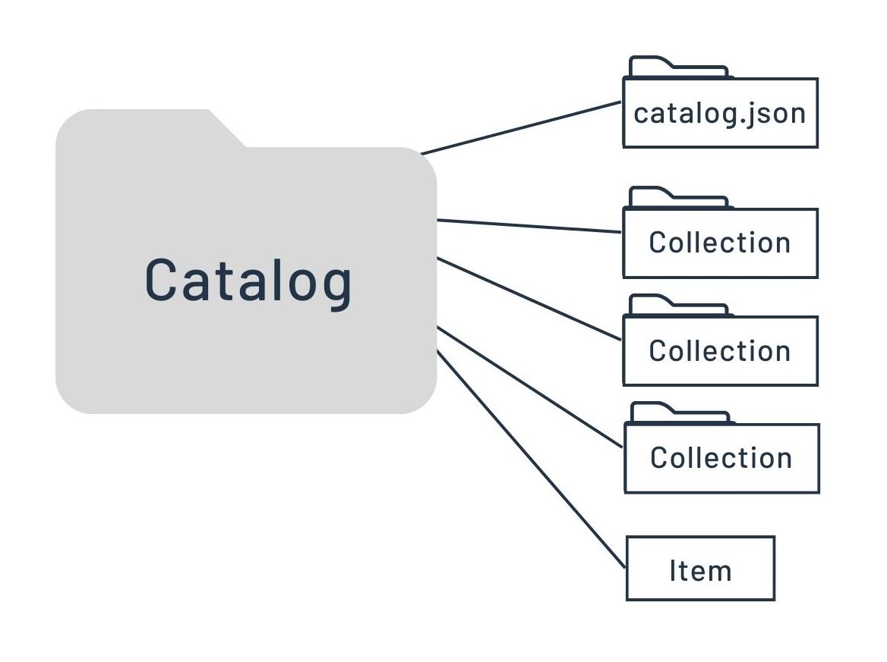

# STAC

## Why STAC?  

Because it's **_FAIR_**!

 
    

Here are some highlights from the [STAC Spec](https://stacspec.org) landing page.
>>When a user wants to search for all the imagery in their area and time of interest they can’t make just one search — they have to use different tools and connect to API’s that are similar but all slightly different. STAC aims to make that much easier, by providing common metadata to expose geospatial assets.

Space, and Time?  And no, we aren't talking about General Relativity.  

<figcaption><strong>Figure:</strong> Datacube rendering to visualized data collection over time.  Taken from <a href="https://data.inpe.br/bdc/web/en/stac-spatiotemporal-asset-catalog-2/">Brazil Data Cube</a>.  This makes more sense for more frequently collected data (e.g., satellite).

Yes, you can simultaneously query by geography and dates for an area of interest.

**But How?** Because STAC is a way to serve earth observation data via its metadata.
>STAC aims to make that much easier, by providing common metadata to expose geospatial assets.

## What makes a STAC?  

In short, it's indexing data by its time and space attributes.

The basic components of a STAC are the following:

1. Item
    - data + metadata
    - file location
    - date collected
    - relevant links
        - thumbnails
        - world files
        - viewers

    
    <figcaption><strong>Figure: </strong> Graphic borrowed from the <a href="https://stacspec.org/en/tutorials/intro-to-stac/">STAC Spec</a>.

2. Catalog
    - structure or heirarchy
    - groups of child catalogs
    - list of stac items

    
    <figcaption><strong>Figure: </strong> Graphic borrowed from the <a href="https://stacspec.org/en/tutorials/intro-to-stac/">STAC Spec</a>.

3. Collection
    - extension of a catalog
    - more metadata
        - date ranges
        - equipment
        - providers
        - more metadata

    
    <figcaption><strong>Figure: </strong> Graphic borrowed from the <a href="https://stacspec.org/en/tutorials/intro-to-stac/">STAC Spec</a>.

4. **STAC API**

    - enables the search component

        - data(base) backend - Postgres, Opensearch, etc.
        - serverless architecture - Lambda, Geoparquet, etc.

    - [OpenAPI specification](https://swagger.io/specification/)  
    - Open Geospatial Consortium [(OGC) WFS3](https://ubuntu.qgis.org/qgisdata/QGIS-Documentation/live/html/en/docs/server_manual/services/ogcapif.html)

___
## TL;DR
___

1. The STAC Specification is the common structure that describes and catalogs spatiotemporal Assets.  
2. It is indexing spatiotemporal data
3. Leverages metadata
4. Items are the basic atomic unit
5. Catalogs provide structure
6. Collections are an extension of the catalog that help describe the data or subset of data in a similar manner.  

